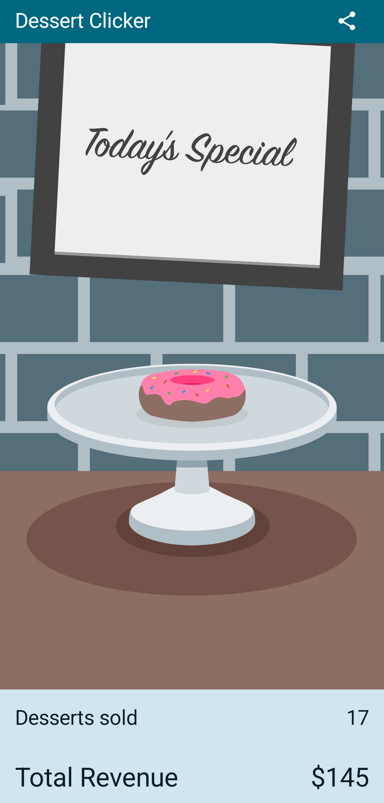

# Dessert Clicker App



## About
The **Dessert Clicker** app is a simple Android app built with **Jetpack Compose**. Users can click a button to "order" desserts, and the app tracks the number of desserts ordered and the total revenue.

This project was created to learn about the **Activity Lifecycle** in Android and how to handle configuration changes like screen rotation.

## Features
- Click to order desserts.
- Track total revenue.
- Logs lifecycle events (e.g., `onCreate`, `onStart`).
- Handles screen rotation by saving and restoring the app state.

## How to Run
1. **Clone the Repository**:
   ```bash
   git clone https://github.com/mihail-trajkovski/dessert-clicker.git
